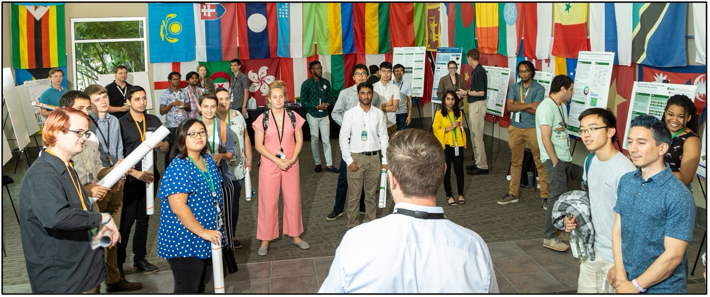

# ORNL’s Secure, Trustworthy, and Energy-Efficient Artificial Intelligence Summer Institute

The Artificial Intelligence Summer Institute (AISI) aims to foster the growth of a diverse workforce in the fields of Artificial Intelligence and Machine Learning (AI/ML) to advance the development and application of secure and trustworthy AI/ML technologies for scientific discovery and create a more inclusive and innovative future for the field.

The AISI is excited to offer a comprehensive series of entry-level courses.
These courses are designed to introduce students to a wide range of cutting-edge AI technologies, including Large Language Models, Graph Neural Networks, AI Foundation Models, Large Model Training on the Frontier Supercomputers, and Uncertainty Quantification of AI Models.

Each half-day course will begin with a comprehensive overview of a specific AI method, highlighting its importance and transformative potential across various fields such as energy, environmental science, material science, and data analytics.
Following this, the course will present practical examples to demonstrate the versatility of the AI tools in scientific and engineering contexts, enabling students to see their applications in real-world scenarios.
Each session includes a hands-on component where participants can enhance their understanding and skills through structured exercises.
Additionally, participants will have the opportunity to work in small groups, fostering a collaborative learning environment that encourages discussion and knowledge exchange.
Overall, these courses are designed not only to educate but also to inspire students to integrate AI into their future research, equipping them with both theoretical knowledge and practical expertise.

The tutorials will be held hybrid. Microsoft Teams link and Conference room will be announced for each course.

<a href="#top"> &#10558; Back to top</a>

# Schedule

Please reach out if you are interested in obtraining the course materials.

| Date | Time | Topic | Lecturers |
|------|------|-------|-----------|
| 06/13/2024 | 9:00 AM - 12:00 PM | Generative Natural Language Processing Primer: Riding the Journey to Large Language Models | [Tirthankar Ghosal](https://www.ornl.gov/staff-profile/tirthankar-ghosal)  [Emily Herron](https://www.ornl.gov/staff-profile/emily-j-herron) [Vanessa Lama](https://www.ornl.gov/staff-profile/vanessa-lama)  |
| 07/02/2024 | 9:00 AM - 12:00 PM | Training Large Language Models in Scale | [Sajal Dash](https://www.ornl.gov/staff-profile/sajal-dash) |
| 07/17/2024 | 9:00 AM - 11:00 AM | Intro to LLM-assisted HPC programming | [Pedro Valero-Lara](https://www.ornl.gov/staff-profile/pedro-valero-lara) |
| 07/25/2024 | 9:00 AM - 12:00 PM | Training Graph Neural Network Models at Scale on DOE Leadership class supercomputing facilities | [Massimiliano (Max) Lupo-Pasini](https://www.ornl.gov/staff-profile/massimiliano-lupo-pasini)   |

<a href="#top"> &#10558; Back to top</a>

# Organization

For questions, please contact us.

|    |    |    |
|----|----|----|
|  |  |
| Dan Lu   Senior Staff Scientist   Computational Sciences and Engineering Division   ORNL | Prasanna Balaprakash  Director of AI Programs   Distinguished R&D Staff Scientist  Computing and Computational Sciences Directorate, ORNL |

<a href="#top"> &#10558; Back to top</a>