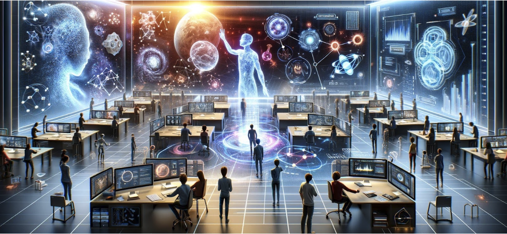

# ORNL AI Initiative: Secure, Trustworthy, and Energy-Efficient AI for Science Tutorial Series

ORNL [AI Initiative](https://www.ornl.gov/ai-initiative)’s tutorial series is designed to equip the scientific community with cutting-edge methodologies, technologies developed within ORNL and specifically through the AI initiative.

Each half-day tutorial is structured to cover a broad spectrum of **AI for science** applications, from graph neural networks in materials modeling to machine learning in hyperspectral image reconstruction.

The tutorials are designed for researchers of all levels who seek to deepen their understanding of AI for Science.
Our primary audience includes researchers with a foundation in AI, aiming to explore and implement advanced, trustworthy AI techniques within scientific contexts.
Additionally, we invite researchers and practitioners from the industry, as well as graduate, postgraduate, and undergraduate students from universities who are engaged in AI research and aspire to acquire knowledge specifically in AI for science.
Although we will touch upon fundamental concepts in AI for science, our curriculum does not encompass introductory AI topics.

The tutorials will place a strong emphasis on open-source principles and non-sensitive topics and content.
We will share open-source code, provide detailed code walkthroughs, and offer hands-on exercises to enhance learning and engagement.

The tutorials will be held **virtually**, allowing participants to join virtually.
Microsoft Teams link will be announced.

Registration is not required for ORNL participants.
For non-ORNL participants, an entry pass is required even for virtual attendance.
For non-US citizens, this process may take up to **45** days.
Please email Jessica Woods at woodsjb@ornl.gov **and** Taylor Bullock at bullocktm@ornl.gov. 
Include a short bio and explain why you wish to attend the tutorial series.
Note that the tutorials will be recorded and made available online after 2-3 weeks.
Therefore, please request an entry pass only if you need to attend virtually.

<a href="#top"> &#10558; Back to top</a>

# Next Tutorial

# Past Tutorial

**Material Property Prediction with Large Scale GNNs**
 Time: 03/28/2024, 2:00 PM - 4:00 PM (ET)
  Virtual (Microsoft Teams)
 [Massimiliano Lupo Pasini](https://www.ornl.gov/staff-profile/massimiliano-lupo-pasini)
 Oak Ridge National Laboratory

|         |
| ------- |
| |
| Massimiliano Lupo Pasini  Staff Scientist Computing and Computational Sciences Directorate, ORNL |

**Abstract**

During the tutorial, we will show how to use HydraGNN (https://github.com/ORNL/HydraGNN), our scalable implementation of multi-task learning graph neural networks developed at Oak Ridge National Laboratory #ORNL as part of the ORNL Artificial Intelligence Initiative.
After discussing scientific motivations behind the need to develop scalable GNN training to support scientific applications of interest to the US Department of Energy (DOE), we will cover a hands-on session with examples of increasing difficulty. In particular, we will show how HydraGNN can be used to scale the training of GNN models on millions of atomic structures on OLCF-Summit, NERSC-Perlmutter, and OLCF-Frontier. To this day, we achieved linear scaling on these DOE leadership class supercomputing facilities using up to 1,024 GPUs.

**Bio**

Massimiliano (Max) Lupo Pasini obtained his Bachelor of Science and Master of Science in Mathematical Engineering at the Politecnico di Milano in Milan, Italy. The focus of his undergraduate and master studies was statistics and discretization techniques and reduction order models for partial differential equations. He obtained his PhD in Applied Mathematics at Emory University in Atlanta (GA) in May 2018. The main topic of his doctorate work was the development of efficient and resilient linear solvers for upcoming computing architectures moving towards exascale. Upon graduation, Max joined the Oak Ridge National Laboratory (ORNL) as a Postdoctoral Researcher Associate in the Scientific Computing Group at the National Center for Computational Sciences (NCCS).

In November 2019, Max became a computational scientist in the Scalable Algorithms and Coupled Physics Group in the Advanced Computing Methods for Engineered Systems Section of the Computational Sciences and Engineering Division at ORNL. In November 2020, Max became a data scientist in the Computational Coupled Physics group within the same section.

Max’s research focuses on the development of surrogate and generative AI models for material sciences, scalable hyper parameter optimization techniques for deep learning (DL) models, and acceleration of computational methods for physics applications. He was the technical lead of the Surrogates Models for Material Properties product within the Artificial Intelligence for Science and Discovery (AISD) thrust of the ORNL Artificial Intelligence Initiative in the fiscal years FY21, FY22, and FY23. He is currently the interim technical lead of the AISD thrust for fiscal years FY24 and FY25.

> [slides](https://www.dropbox.com/scl/fi/db5nw096d6y2s20mvrgu0/HydraGNN_AI_Tutorial_Series_03282024.pdf?rlkey=juiz1da3bnuld62jancqecdi5&dl=0)

<a href="#top"> &#10558; Back to top</a>

---

**ExpM+NF: Are normalizing flows the key to unlocking the exponential mechanism? Our efforts to advance differentially private machine learning**
 Time: 04/25/2024, 2:00 PM - 4:00 PM (ET)
  Hybrid (4100, J302; Microsoft Teams)
 [Robert A Bridges](https://www.ornl.gov/staff-profile/robert-bridges)
 Oak Ridge National Laboratory

|         |
| ------- |
| |
| Robert A Bridges  Research Scientist Computing and Computational Sciences Directorate, ORNL |

**Abstract**

Training machine learning models on data with privacy concerns is an increasingly common and needed situation.
Differential privacy provides a mathematical framework for rigorously guaranteeing privacy while releasing information—roughly speaking, one makes a deterministic algorithm into a randomized algorithm (e.g., by adding noise to the output) in such a way that it masks the original data.
Of course, accuracy is sacrificed for the gain of privacy.
Unfortunately, the state of the art in differentially private stochastic gradient descent (DPSGD), which is the state of the art for private machine learning, is inadequate in practice as it leads to insufficient accuracy-privacy tradeoffs.
How can we transform this field to produces sufficiently accurate models while simultaneously protecting our privacy?
This talk presents our work to explore a new approach to differentially private machine learning.  
 
First necessary background will be given.
I’ll provide an introduction to differential privacy requiring no background in the field with a focus on differentially private machine learning.
Our target is understanding the state of the art, DPSGD.
The second portion of background material will introduce normalizing flows models—a family of deep learning neural networks that, by design, preserve probability densities, and hence can be used to approximate intractable probability densities.
Basic understanding of supervised machine learning and neural networks is required.
 
Once equipped with the needed background, I’ll present our new approach, ExpM+NF.
This exploratory project investigates if we can use the Exponential Mechanism—a differential privacy mechanism for optimization—to train machine learning models with privacy.
Historically, the exponential mechanism has been sidelined as it requires sampling from an intractable distribution.
Can normalizing flow models, deep neural networks designed for handling intractable distributions be the key?
Our year 1 work seeks to answer the question "Can we train a model by sampling from the exponential mechanism via an auxiliary normalizing flow?".
Experiments and results will be presented. Our current (year 2) work seeks to prove a differential privacy guarantee that incorporates the normalizing flow's approximation to the "real" exponential mechanism distribution.

**Bio**

Robert A. Bridges (Bobby), is a Senior Research Mathematician at ORNL sitting in the National Security Sciences Directorate.
Bobby currently focuses on advancing differentially private machine learning (as this talk may suggest), and using mathematical system models to identify feedback vulnerabilities.
Bobby holds an undergraduate degree from Creighton University in mathematics as well as a PhD in mathematics from Purdue University (and he is very happy with both teams’ deep run in the March Madness tourney!)
Leaving pure mathematics, Bobby was fortunate to obtain a postdoc position at ORNL in 2012, where he has since supported a wide variety of projects with machine learning, statistical, and applied math expertise.
Previous work includes leading projects on intra-vehicle network security and reverse engineering algorithms, leading large-scale experiments testing commercial security tools, and serving for 2 years as the Cybersecurity Research Group Leader.

> [slides](https://www.dropbox.com/scl/fi/qzbiapsp4llsu6e5in0ky/2024-04-25-tutorial.pdf?rlkey=ag8cvjbvy7ov9xtq3eb1kn97g&dl=0)

---

**PI3NN: Uncertainty Quantification for ML models**
 Time: 06/28/2024, 9:00 AM - 12:00 PM (ET)
  Virtual (Microsoft Teams)
 [Dan Lu](https://www.ornl.gov/staff-profile/dan-lu)
 Oak Ridge National Laboratory

|         |      |
| ------- | ---- |
| |  |
| Dan Lu  Senior Research Scientist Computing and Computational Sciences Directorate, ORNL | Siyan Liu  Research Scientist Computing and Computational Sciences Directorate, ORNL |

**Abstract**

In machine learning (ML), understanding and quantifying prediction uncertainties is crucial, particularly when decisions rely on ML outputs.
In this tutorial, we will introduce PI3NN (https://github.com/liusiyan/UQnet), a prediction interval-based method for uncertainty quantification (UQ) of ML models.

We will begin with an overview of UQ in ML, discussing its significance and impact across various research fields.
We will then explore the basics of the PI3NN method, providing practical examples to demonstrate its broad applicability in diverse scientific domains.
The tutorial will include a hands-on session where participants can familiarize themselves with this method through examples that include dense neural networks with synthetic data and Long Short-Term Memory networks with real observations.
We will guide participants step-by-step through the process in a Google Colab Notebook format, enhancing both understanding and practical skills.

**Bio**

Dan Lu is a Senior Staff Scientist in the Computational Earth Sciences Group in the Computational Sciences and Engineering Division.
Her research interests include Machine Learning (ML), Uncertainty Quantification (UQ), Surrogate Modeling, Inverse Modeling, Multimodel Analysis, Sensitivity Analysis, Experimental Design, and Numerical Simulations of Hydrological and Earth Systems.
Dan is the PI of multiple projects funded by both the Office of Science and Applied Offices within DOE, including an UQ for ML project, an Earth System Modeling project, a Hydropower project, and a Geological Carbon Storage project.
She has served on several editorial boards of international journals, organized dozens of technical workshops, authored over 70 publications, and developed two software.
Dan earned her Ph.D. in Computational Hydrology at Florida State University in 2012, and received the DOE Early Career Award in 2023.

Siyan Liu is a research scientist at Oak Ridge National Laboratory (ORNL), working with the Computational Earth Sciences Group (CESG) and AI initiative.
He finished his Ph.D. degree in Chemical & Petroleum Engineering and worked as a postdoc at ORNL before his current role.
He has broad research interests, including developing various AI models and foundational models, uncertainty quantification, HPC and scalable AI model training, AI for science applications, numerical simulation of fluid flow in porous media, computational fluid dynamics (CFD), reservoir simulation, apply data analytics and artificial intelligence on other science and engineering problems, and high-performance parallel computing.

---

**VAE-NCDE: a generative time series model for probabilistic multivariate time series forecasting**

 Time: 07/26/2024, 9:00 AM - 12:00 PM (ET)
  Virtual (Microsoft Teams)
 [William L Gurecky](https://www.ornl.gov/staff-profile/william-l-gurecky)
 Oak Ridge National Laboratory

|         |
| ------- |
| |
| William L Gurecky  Research Scientist Computing and Computational Sciences Directorate, ORNL |

**Abstract**

TBA

**Bio**

William is an R&D associate in the Nuclear Energy and Fuel Cycle Division at Oak Ridge National Laboratory.
He currently works with the Power Reactor Modeling group developing performant software solutions to address industry identified challenge problems.
His research interests include applying Bayesian statistics and machine learning to reactor physics problems.
As the principle investigator of a laboratory directed research and development project, William developed a flexible parallel optimization package, ML-PSA, that joins modern machine learning methods with multi-fidelity physics tools to solve multi-constrained and combinatorial optimization problems encountered in reactor core design. 

William co-developed the crud simulation code, MAMBA, that is a coupled component of the Virtual Environment for Reactor Applications (VERA).
MAMBA allows prediction of crud-induced power shifts, constituting a key capability in the Consortium for the Advanced Simulation of LWRs' (CASL) technical portfolio.
Additionally, he develops reduced order models and applies statistical inference techniques to a variety of model calibration tasks in MAMBA and CTF.

William holds a B.Sc. in Mechanical Engineering (2013), an M.S.E. in Mechanical Engineering (2015) and a Ph.D. in Nuclear & Radiation Engineering (2018) from the University of Texas at Austin.
In his doctoral work, William developed a statistical downscaling method to capture the influence of fine-scale flow details down stream from spacer grids on the growth rate of crud in PWRs.

---

**ML-Based Sparse Image Reconstruction On The Edge**

 Time: 10/18/2024, 9:00 AM - 12:00 PM (ET)
  Virtual (Microsoft Teams)
 [Rama K. Vasudevan](https://www.ornl.gov/staff-profile/rama-k-vasudevan), [Narasinga Rao Miniskar](https://www.ornl.gov/staff-profile/narasinga-r-miniskar), [Anthony Cabrera](https://www.ornl.gov/staff-profile/anthony-m-cabrera), and [Singanallur V. Venkatakrishnan ](https://www.ornl.gov/staff-profile/singanallur-v-venkatakrishnan?type=publications&page=0)
 Oak Ridge National Laboratory

|      |      |      |      |
| ---- | ---- | ---- | ---- |
| |  |  |  |
| Rama K. Vasudevan  Group Leader, Data NanoAnalytics (DNA) Group  Center for Nanophase Materials Sciences, ORNL | Narasinga Rao Miniskar  Senior R&D Staff Computer Science and Mathematics Division, ORNL | Anthony Cabrera  Research Scientist  Computer Science and Mathematics Division, ORNL | S. V. Venkatakrishnan  R&D Staff  Electrification and Energy Infrastructures Division, ORNL |

**Abstract**
Hyper-spectral imaging is of key importance to rapidly determining the functional properties of materials when deployed from conventional microscopy techniques, but also sees significant applications in areas of optical (satellite) imagery and medical imaging technologies for e.g., determining changes to land use, functional changes to organs, etc. The sparse scanned image data from scanning probe microscopy instruments improves overall scanning speed but the original image need to be reconstructed from this sparse data, which is very challenging. In this tutorial, we walk through the hyperspectral image reconstruction traditional method (Biharmonic) and AI based methods (Deep Inverse), and provide an insight on deploying these algorithms on FPGA.

Tentative agenda:
- Introduction of ML-HSIR project by Rama Vasudevan (~15 m)
- Hyperspectral image reconstruction algorithms by Venkatakrishnan Singanallur (~45m)
- Biharmonic based image reconstruction and deployment on FPGA by Narasinga Rao Miniskar (~45m)
- Deep Neural Network (Deep Inverse) based image construction and deployment on FPGA by Anthony Cabrera.  (~45m)

**Bio**

- Rama K. Vasudevan is a Group Leader for Data NanoAnalytics (DNA) Group at Center for Nanophase Materials Sciences, Oak Ridge National Laboratory. His research is focused on smart, autonomous synthesis and characterization tools driven by improvements in machine learning and tight integration between theory, automation and individual instruments. Specific sub-focus is on applications and development of scalable reinforcement learning for scanning probe microscopy, to optimize, manipulate and better characterize ferroic materials at the nanoscale, and upgrade scanning probe microscopy from a standard characterization tool to one capable of autonomous physics discovery by connecting algorithms, edge computing and theory in end-to-end automated workflows.
- Narasinga Rao Miniskar is a Group Leader for Architecture and Performance Group at Computer Science and Mathematics Division, Oak Ridge National Laboratory. is current research is on heterogeneous computing, FPGA acceleration, Neuromorphic computing (Spiking Neural Network accelerators) and RISC-V based accelerators. Prior to this, he has worked in Samsung R&D Institute Bangalore (SRIB) for ~8 years on fixed point deep learning inference framework, Samsung Reconfigurable Processors development toolchain (compiler, cycle accurate simulators, etc.) and architecture exploration. He has received Ph.D. from K.U.Leuven and IMEC R&D (Belgium) in 2012.
- Anthony Cabrera is a Research Scientist in the Architectures and Performance Group at Oak Ridge National Laboratory. His research currently focuses on node-level heterogeneity. In general, he is interested in compilers, computer hardware design, and quantum computing.
- S. V. Venkatakrishnan received the Ph.D. degree from the School of Electrical and Computer Engineering at Purdue University in 2014. He is currently a R&D Staff member at the Multimodal Sensor Analytics group at Oak Ridge National Laboratory developing computational imaging algorithms in support of the lab’s efforts in ultrasound, X-ray, electron and neutron-based systems. His research interests include Computational Imaging, Inverse Problems and Machine Learning.  He was awarded a Presidential Scholar Award at the Microscopy and Microanalysis conference (2014), and the Eugene P. Wigner Distinguished Staff Fellowship at Oak Ridge National Lab (2016-2019). Dr. Venkatakrishnan is a senior member of the IEEE and has served as an Associate Editor of the IEEE Trans. On Computational Imaging (2018-2024).

# Schedule 

Please reach out if you are interested in presenting at a future event

| Date | Title | ORNL Tutorial Lead |
| ---- | ----- | ------------------ |
| 03/28/2024 | Material Property Prediction with Large Scale GNNs | [Massimiliano Lupo Pasini](https://www.ornl.gov/staff-profile/massimiliano-lupo-pasini) |
| 04/25/2024 | ExpM+NF: Are normalizing flows the key to unlocking the exponential mechanism? Our efforts to advance differentially private machine learning | [Robert A Bridges](https://www.ornl.gov/staff-profile/robert-bridges) |
| 06/28/2024 | PI3NN: Uncertainty Quantification for ML models | [Dan Lu](https://www.ornl.gov/staff-profile/dan-lu)   [Siyan Liu](https://www.ornl.gov/staff-profile/siyan-liu) |
| 07/26/2024 | VAE-NCDE: a generative time series model for probabilistic multivariate time series forecasting | [William L Gurecky](https://www.ornl.gov/staff-profile/william-l-gurecky) |
| 10/18/2024 | ML-HSIR: Machine Learning based Hyperspectral Image Reconstruction the edge | [Narasinga Rao Miniskar](https://www.ornl.gov/staff-profile/narasinga-r-miniskar) |
| 11/15/2024 | Intro to causal and explainable models in materials science | [Ayana Ghosh](https://www.ornl.gov/staff-profile/ayana-ghosh) |
| 12/13/2024 | PPSD: Privacy preservation for streaming data | [Olivera Kotevska](https://www.ornl.gov/staff-profile/olivera-kotevska) |

<a href="#top"> &#10558; Back to top</a>

# Organization

For questions, please contact us.

|                |                |                |
| -------------- | -------------- | -------------- |
|  |  |  |
| Jong Youl Choi   HPC Data Research Scientist   Computer Science and Mathematics Division   ONRL | Chen Zhang   Computational Scientist   Computer Science and Mathematics Division   ONRL | Prasanna Balaprakash  Director of AI Programs   Distinguished R&D Staff Scientist  Computing and Computational Sciences Directorate, ORNL |

<a href="#top"> &#10558; Back to top</a>
